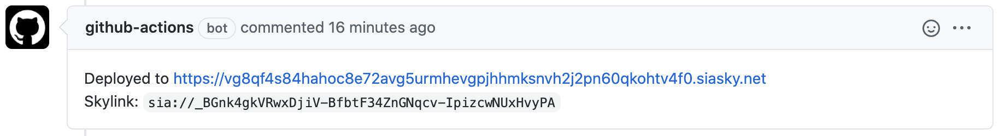

# Deploy to Skynet action

This action deploys a directory to [Skynet](https://siasky.net) and comments on pull request with a skylink url.



**Caveat:** This action will only comment on a pull request coming from same account/organization. If the pull request is from a forked repo, this action will not be able to create a comment due to limited permissions but you will still be able to drill down the action logs and access the skylink and deploy url manually.

## Inputs

### `upload-dir`

**Required** Directory to upload (usually `dist`, `out` or `public`).

This action requires the upload directory to be already available so you will need to run the build step before running this action.

### `github-token`

**Required** Your github token that is required to authenticate posting a comment on pull request.

Find out more about github token from [documentation](https://docs.github.com/en/free-pro-team@latest/actions/reference/authentication-in-a-workflow).

### `registry-seed`

You can provide a seed (keep it secret, keep it safe) and this action will set corresponding skynet registry entry value to the deployed skylink.

Public link to the registry entry will be printed in the action log.

## Outputs

### `skylink`

The resulting skylink.

Example: `sia://IAC6CkhNYuWZqMVr1gob1B6tPg4MrBGRzTaDvAIAeu9A9w`.

## Example usage

```yaml
uses: kwypchlo/deploy-to-skynet-action@main
with:
  upload-dir: public
  github-token: ${{ secrets.GITHUB_TOKEN }}
  registry-seed: ${{ secrets.REGISTRY_SEED }}
```

### Full workflow example

```yaml
name: My CI Pipeline

on:
  pull_request:
  push:
    branches:
      - main

jobs:
  build:
    runs-on: ubuntu-latest

    steps:
      - uses: actions/checkout@v2
      - name: Use Node.js
        uses: actions/setup-node@v1
        with:
          node-version: 14.x

      - name: Install dependencies
        run: yarn

      - name: Build webapp
        run: yarn build

      - name: Deploy to Skynet
        uses: kwypchlo/deploy-to-skynet-action@main
        with:
          upload-dir: public
          github-token: ${{ secrets.GITHUB_TOKEN }}
          registry-seed: ${{ github.event_name == 'push' && github.ref == 'refs/heads/main' && secrets.REGISTRY_SEED || '' }}
```
